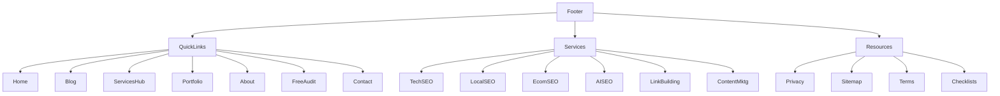

# Internal Linking Strategy — RankrSEO

> Generated: 2026-06-22
> Goal: Maximize crawl efficiency, distribute link equity, build topical authority

---

## 1. Linking Architecture Principles

### Depth Rule
- Every page should be reachable within 3 clicks from homepage
- No orphan pages (every page must have at least 1 inbound internal link)
- Service pages link to related blog posts (and vice versa)

### Anchor Text Rules
- Use exact match for primary KWs sparingly (20%)
- Use partial match for secondary KWs (50%)
- Use generic/contextual for tertiary links (30%)
- Never use "click here" or "read more"

---

## 2. Navigation Link Map

```
Homepage
├── Services (dropdown nav)
│   ├── SEO Audit → /p/seo-audit-services.html
│   ├── Technical SEO → /p/technical-seo-services.html
│   ├── Local SEO → /p/local-seo-services.html
│   ├── Ecommerce SEO → /p/ecommerce-seo.html
│   ├── AI SEO / GEO → /p/ai-seo-services.html
│   ├── Blogger SEO → /p/blogger-seo.html
│   ├── Content Marketing → /p/content-marketing.html
│   ├── Link Building → /p/link-building.html
│   ├── Digital Marketing → /p/digital-marketing.html
│   └── All Services → /p/services.html
├── Blog → data:blog.homepageUrl
├── Portfolio → /p/portfolio.html
├── About → /p/about.html
└── Contact → /p/contact-us.html
```

---

## 3. Service Page → Blog Post Links

Each service page should link to 3-5 relevant blog posts:

| Service Page | Links To Blog Posts |
|-------------|-------------------|
| technical-seo-services | technical-seo-checklist, core-web-vitals-optimization, javascript-seo-best-practices, schema-markup-implementation-guide, crawl-budget-optimization |
| local-seo-services | local-seo-checklist, google-business-profile-optimization, local-citation-building-guide, multi-location-local-seo, review-management-seo |
| ecommerce-seo | ecommerce-seo-checklist, shopify-seo-optimization-guide, product-page-seo-guide, ecommerce-site-structure-seo |
| seo-audit-services | seo-audit-checklist, seo-audit-tools-guide, how-to-perform-seo-audit, technical-seo-audit-template |
| ai-seo-services | ai-seo-guide, chatgpt-seo-optimization, answer-engine-optimization-guide, entity-seo-ai-search, google-sge-optimization-guide |
| link-building | white-hat-link-building-guide, guest-posting-strategy-guide, digital-pr-link-building, link-building-outreach-guide |
| content-marketing | seo-content-writing-guide, blog-content-strategy-guide, pillar-page-topic-cluster-guide |
| digital-marketing | content-marketing, seo-content-writing-guide, blog-content-strategy-guide |
| blogger-seo | blogger-seo-guide, blogger-speed-optimization, blogger-schema-markup-guide, blogger-theme-seo-optimization, blogger-vs-wordpress-seo |
| enterprise-seo | technical-seo-services, seo-audit-services, what-does-seo-agency-do |

---

## 4. Blog Post → Service Page Links

Every blog post should link back to its relevant service page:

| Blog Cluster | Links To Service Page |
|-------------|---------------------|
| Technical SEO articles | technical-seo-services |
| Local SEO articles | local-seo-services |
| Ecommerce SEO articles | ecommerce-seo |
| AI SEO articles | ai-seo-services |
| SEO Audit articles | seo-audit-services |
| Link Building articles | link-building |
| Content articles | content-marketing |
| SEO Strategy articles | seo-agency |
| Blogger articles | blogger-seo |
| Comparisons | seo-agency (with anchor: "best choice for your needs") |

---

## 5. GEO Page → Service Page Links

Each GEO page should link to:
1. Primary service pages (technical-seo-services, local-seo-services, etc.)
2. Homepage (with location anchor text)
3. Free SEO Audit (CTA)
4. Contact page

---

## 6. Footer Link Architecture



---

## 7. Link Equity Distribution

### High Equity Pages (Link To)
- Homepage (highest equity — link to key service pages)
- Services hub page
- SEO Audit (conversion page)
- Contact page (conversion page)

### Medium Equity Pages (Link From + To)
- Service pages (link to blog posts + back)
- GEO pages (link to service pages)
- Blog pillars (link to service pages + sub-articles)

### Low Equity Pages (Link From)
- Blog sub-articles (link up to pillar/service)
- Supporting content

---

## 8. Current Issues to Fix

| Issue | Severity | Fix |
|-------|----------|-----|
| Service pages don't link to blog posts | 🔴 High | Add contextual links in service page content |
| Blog posts link inconsistently to services | 🟡 Med | Standardize "Related Service" callout in every post |
| GEO pages have weak internal linking | 🟡 Med | Add more internal links to service pages |
| Some blog posts are orphaned | 🔴 High | Ensure every post is linked from at least 1 service page |
| Footer doesn't link to blog clusters | 🟢 Low | Add "Resources" links to key checklist pages |

---

## 9. SILO Structure by Cluster

```
Technical SEO (Pillar)
├── core-web-vitals-optimization (supports pillar)
├── crawl-budget-optimization (supports pillar)
├── javascript-seo-best-practices (supports pillar)
├── schema-markup-implementation-guide (supports pillar)
├── seo-site-architecture-guide (supports pillar)
├── technical-seo-checklist (supports pillar)
└── technical-seo-audit-template (supports pillar)
    ↓ links back to ↑ Technical SEO Services
```

Each silo follows: Blog Post → Service Page and Service Page → Blog Posts (bi-directional linking)

---

## 10. Implementation Priority

| Task | Priority |
|------|----------|
| Add service → blog links to all 12 service pages | P0 |
| Add blog → service links to all 39 blog posts | P0 |
| Fix orphaned pages (ensure every page has 1+ inbound link) | P0 |
| Add contextual anchor links in GEO pages | P1 |
| Add "Related Services" sections to all blog posts | P1 |
| Create resource hub page linking to all checklists | P2 |
